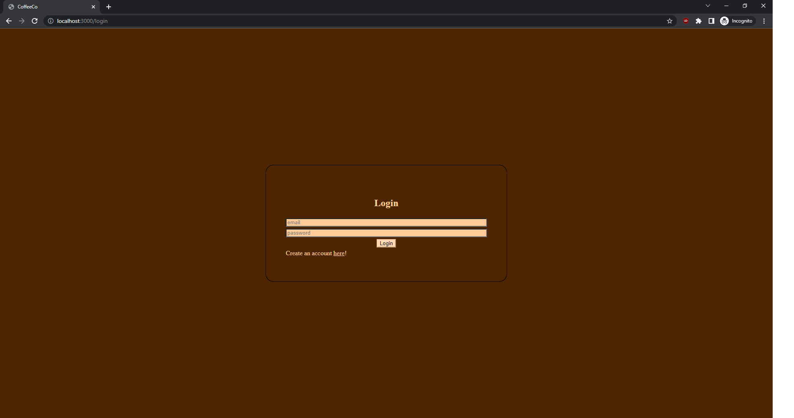
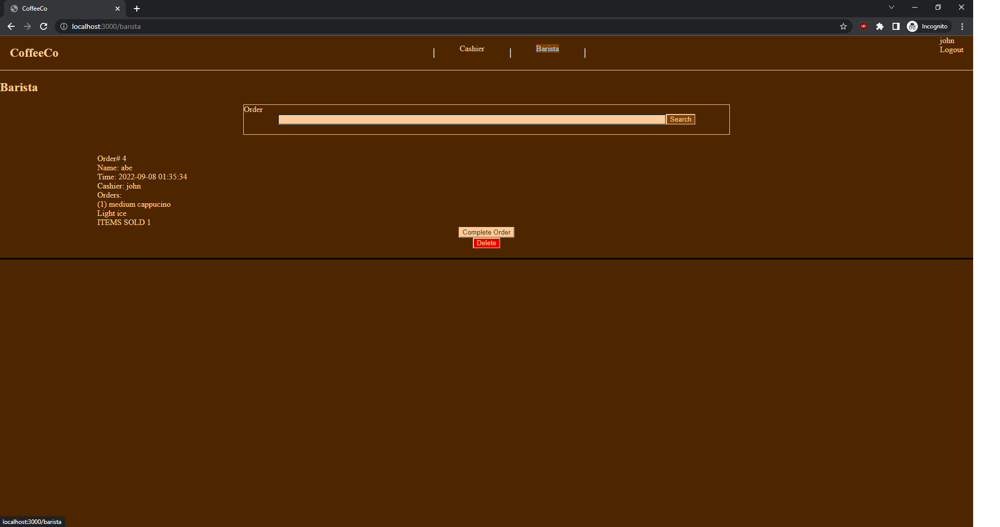

# CoffeeCo

This is the solution to the CoffeeCo

## Table of contents

- [Overview](#overview)
  - [The challenge](#the-challenge)
  - [Screenshot](#screenshot)
  - [Links](#links)
- [My process](#my-process)
  - [Built with](#built-with)
  - [What I learned](#what-i-learned)
  - [Continued development](#continued-development)
  - [How to run this app](#how-to-run-this-app)
- [Author](#author)

## Overview

### The challenge

Users should be able to:
- A form for cashiers to make coffee selections
- Submitting the form sends the coffee to an order form with customer name text input 
- Create a container that display the entered order
- Orders are with an option to mark completed and delete 
- Able to delete order only when it has been marked as complete
- See hover states for all interactive elements on the page

### Screenshot

### Links
- Solution URL: [https://github.com/xuwil1/CoffeeCo]

### Login crendential / Register your own

- Username: test@123
- Password: test

## My process

### Built with

- HTML5 
- CSS 
- Node.js
- Ejs
- Mongoose

### What I learned
This is a full stack application with authorization. This application helped me understand all the function of a full CRUD application and thought me how to use authorization with bcrypt and passport libraries. 

### Continued development
Add more forms of authorization such as OAuth so users can use Google to log in. 
## Available Scripts

### How to run this app. 

In this repository, it contains a .env.example file. Create a .env file. Create a 'DATABASE_URL' variable equal to your MongoDB key and a 'SESSION_SECRET' variable equal to anything you want.
## `npm install`
Run this to install all dependencies required for the application.
## `npm run dev`
Run this to start application in dev mode with nodemon.

## Author

- Website - [Willie Xu](https://xuwil1.github.io/Portfolio/)

